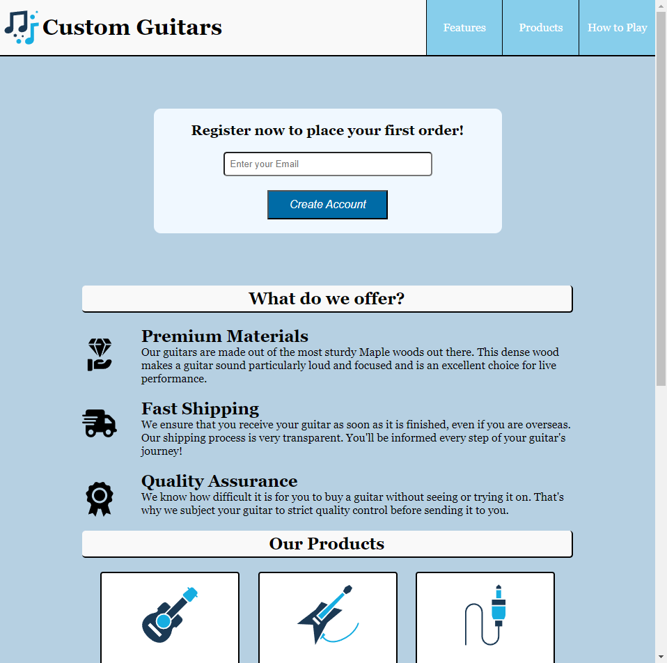
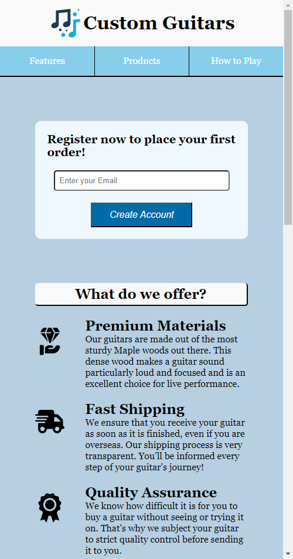

# Product Landing Page
This is one of the required projects to earn freeCodeCamp's Responsive Web Design Certification.

For this project, the goal is to build a product landing page to market a product of choice.

🚀 You can access the site at https://cey-s.github.io/ProductLandingPage/

**Preview:**

